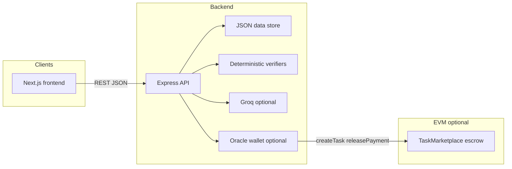
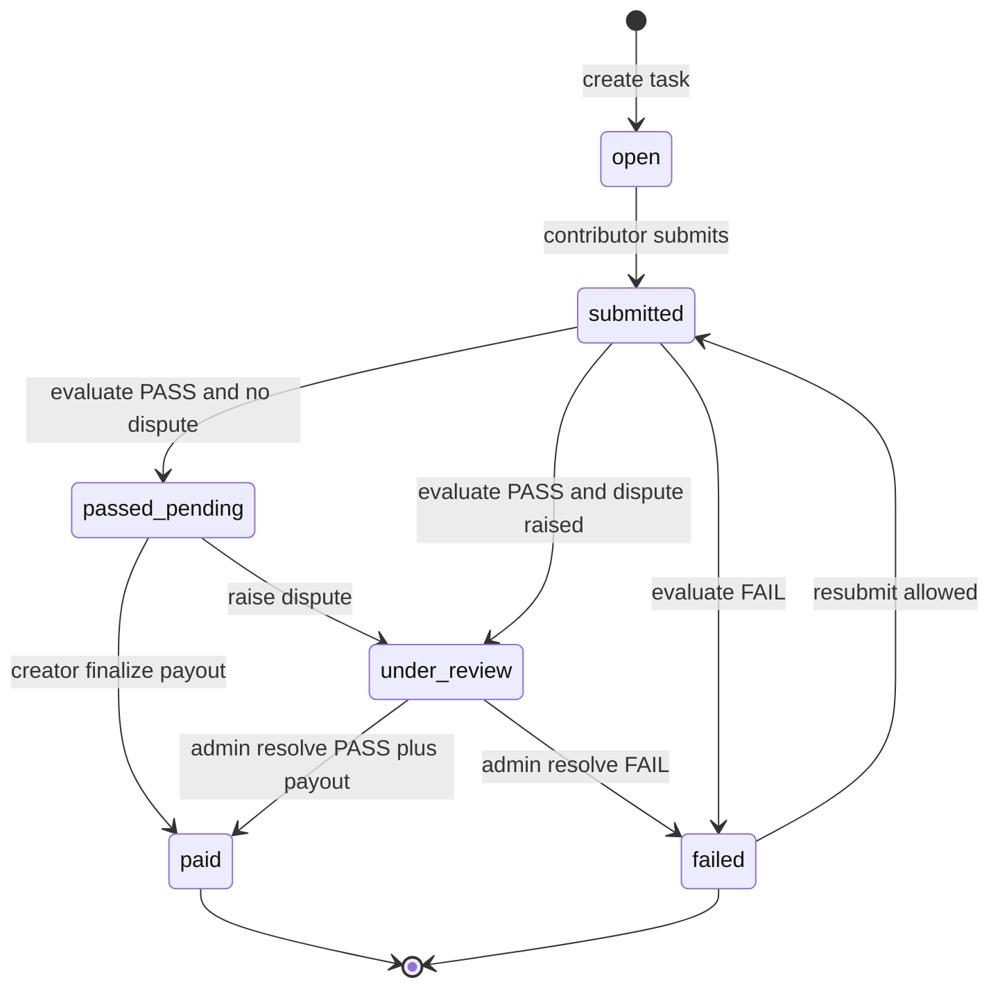

# Minitia — Proof-of-Work AI Task Marketplace

Minitia is a **trustless, AI-verifiable work marketplace for objective tasks**. Creators lock value, define **expected output shape**, **validation method** (tests, JSON schema, or HTTP capture), and **success conditions**. Contributors attach **proof-of-work**: test transcripts, logs, and output references. Deterministic checks decide pass or fail; an LLM is only a **last-resort** path when no objective oracle exists. Payouts follow verification and optional dispute review instead of subjective “looks good” alone.

## Links

- **Project repository:** https://github.com/Mansi2007275/Minitia.git
- **Demo video:** https://www.loom.com/share/6bf0ae82f11a4efda271bcdf74cd6cd4
- **Contact:** https://x.com/AnandVashisht15

## What makes it different

- **Verifiable by default**: code and data paths use structured proofs (test matrix, schema validation, or API capture JSON), not vibes.
- **Explicit contract**: every task stores `expectedOutputFormat`, `validationMethod`, and `successConditions` alongside machine-readable `verificationSpec`.
- **Proof-of-work submissions**: contributors submit `powTestResults`, `powLogs`, and `powOutputFiles` so outcomes are auditable.
- **Contributor trust score**: successful completion (especially verifiable tasks) increases an on-chain-style reputation map stored with the API.
- **Disputes**: raise / human-resolve flows block payout until cleared; evaluation never auto-releases while a dispute is open.

## Architecture

### System context

### Task lifecycle

Evaluation updates status; **on-chain release** runs only from **finalize payout** (creator) or **dispute resolve PASS** (admin), not from evaluate alone.

## Requirements

- Node.js v18+
- Optional: Groq API key (task drafting + generic-only evaluation)
- Optional: deployed task contract + oracle key (otherwise payouts are mocked)

## Setup and run

### Smart contract (optional)

See `contracts/` and deploy to your EVM testnet. Configure `RPC_URL`, `ORACLE_PRIVATE_KEY`, `CONTRACT_ADDRESS` in `backend/.env`.

### Backend

1. `cd backend` and `npm install`
2. Copy `backend/.env.example` to `backend/.env` and set `GROQ_API_KEY` if you want richer `/tasks/generate` output
3. `npm run dev` — API at `http://localhost:5000`

### Frontend

1. `cd frontend` and `npm install`
2. `frontend/.env.local`: `NEXT_PUBLIC_API_BASE_URL=http://localhost:5000` (and `NEXT_PUBLIC_SKIP_CHAIN=1` to run without a contract)
3. `npm run dev` — UI at `http://localhost:3000`

### Full Start (repo root)
`npm run install:all` then `npm run demo` starts API and web together.

## API contract (summary)

| Method | Path                   | Purpose                                                                                                                                                                                                                                                                                           |
| ------ | ---------------------- | ------------------------------------------------------------------------------------------------------------------------------------------------------------------------------------------------------------------------------------------------------------------------------------------------- |
| POST   | `/tasks/generate`      | Body: `{ "rawDescription" }`. Returns `structuredTask` with `title`, `description`, `criteria`, `taskType`, `validationMethod`, `expectedOutputFormat`, `successConditions`, `suggestedVerificationSpec`.                                                                                         |
| POST   | `/tasks`               | Creates a task. Requires `title`, `description`, `criteria`, `reward`, `creatorWallet`, **`expectedOutputFormat`**, **`validationMethod`** (`tests` \| `json_schema` \| `api_capture` \| `llm_fallback`), **`successConditions`**, and `verificationSpec` (merged with AI suggestion when empty). |
| GET    | `/tasks`               | Query `?includeTrust=1` adds `contributorTrust` to tasks that have a `contributorWallet`.                                                                                                                                                                                                         |
| GET    | `/tasks/trust/:wallet` | Returns `{ trustScore, completedVerifiableTasks }` for a wallet.                                                                                                                                                                                                                                  |
| GET    | `/tasks/:id`           | Task detail including PoW fields and dispute state.                                                                                                                                                                                                                                               |
| POST   | `/submit-work`         | Includes optional `powTestResults`, `powLogs`, `powOutputFiles`, plus code/repo fields.                                                                                                                                                                                                           |
| POST   | `/evaluate-submission` | PASS sets `passed_pending` (no automatic payout).                                                                                                                                                                                                                                                 |
| POST   | `/finalize-payout`     | Creator releases when `passed_pending` and no dispute.                                                                                                                                                                                                                                            |
| POST   | `/raise-dispute`       | Freezes payout path.                                                                                                                                                                                                                                                                              |
| POST   | `/resolve-dispute`     | Header `x-admin-secret` + body `outcome` `PASS` \| `FAIL` (simulated human override).                                                                                                                                                                                                             |

Full field lists live in the controller sources under `backend/controllers/`.

## Usage flow

1. Open the app, **Create task**: describe objective work, run **Generate** — edit output format, validation method, and success conditions if needed, then save.
2. **Submit work** with notes plus **PoW** (test output, logs, file links).
3. **Evaluate** — deterministic path returns structured `proof`; PASS moves to `passed_pending`.
4. Creator **Finalize payout** (or raise a **Dispute** first; admin resolves with `/resolve-dispute` using `ADMIN_SECRET`).

## Scripts

- `cd backend && npm run eval:smoke` — runs deterministic verifier examples without the HTTP server.

## Submission checklist (BUIDL)

Use this block when filing your hackathon or grant submission. Fill any remaining placeholders (chain, deployment) when you have them.

| Item                                                      | Your entry                                                                                                                             |
| --------------------------------------------------------- | -------------------------------------------------------------------------------------------------------------------------------------- |
| **Location**                                              | Delhi                                                                                                                                  |
| **Rollup chain ID, transaction link, or deployment link** | Chain ID: `31337`   Contract: `0x76F0c972200C5111366B46Ae8770c0BfC1513d8d` |
| **On-chain submission file**                              | Path in this repo: `.minitia/submission.json` (see BUIDL program docs for the exact JSON schema).                                      |
| **Project repository**                                    | https://github.com/Mansi2007275/Minitia.git                                                                                            |
| **Human-readable summary (README)**                       | https://github.com/Mansi2007275/Minitia#readme                                                                                         |
| **Demo video (1–3 minutes)**                              | https://www.loom.com/share/6bf0ae82f11a4efda271bcdf74cd6cd4                                                                            |
| **Contact**                                               | https://x.com/AnandVashisht15                                                                                                          |

**Quick links**

- Repository: https://github.com/Mansi2007275/Minitia.git
- Demo video: https://www.loom.com/share/6bf0ae82f11a4efda271bcdf74cd6cd4
- Contact: https://x.com/AnandVashisht15
- `.minitia/submission.json` spec: follow official BUIDL submission documentation for field names and rollup proof fields.
- Deployment / chain proof: add when ready
